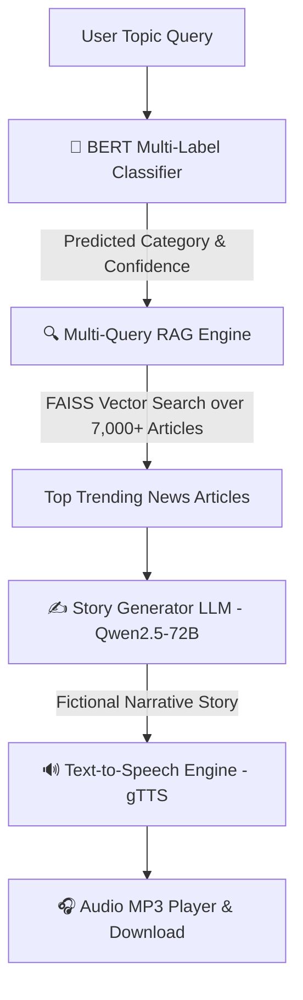

# 🎧 TrendTales AI

> **Real-Time News Trends → BERT Multi-Label Classification → Multi-Query RAG → Qwen2.5 Story Generation → gTTS Audio Story**

**TrendTales AI** is an advanced NLP pipeline and web application that transforms real-world news trends into engaging audio stories. By combining fine-tuned BERT multi-label classification, vector-backed Multi-Query RAG (Retrieval-Augmented Generation), state-of-the-art LLM story writing, and Text-to-Speech synthesis, TrendTales AI delivers personalized, narrative news audio on demand.

---

## 🏗️ System Architecture & Pipeline Flow



### ⚙️ Pipeline Components:
1. **Data Collection & Preprocessing:** Aggregates, cleans, and ranks real news articles from multiple RSS and Google News feeds.
2. **BERT Multi-Label Classifier (`bert_classifier`):** Fine-tuned `bert-base-uncased` model (85.86% Macro F1) detecting up to 8 news categories (*Politics, Economy, Business, Technology, Climate, Science, Education, International Affairs*).
3. **Multi-Query RAG (`rag`):** Vector search powered by SentenceTransformers (`all-MiniLM-L6-v2`) and FAISS index with query expansion for high-precision retrieval over 7,100+ news articles.
4. **Story Generation (`story_generation`):** Synthesizes retrieved news events into a creative, coherent narrative story using Qwen2.5-72B via Hugging Face Inference API.
5. **Text-to-Speech (`story_generation/tts.py`):** Converts generated story text into an MP3 audio recording using gTTS with automatic character sanitization.

---

## 📥 Fine-Tuned Model Weights

The pre-trained fine-tuned BERT model weights (~438 MB) can be downloaded directly:

👉 **[Download Fine-Tuned BERT Model Weights (Google Drive)](https://drive.google.com/file/d/1YNesMp61Eww6z1W_bxNPU-3ke9BsQPU-/view?usp=sharing)**

**Installation:**
1. Download `saved_model.zip` from the link above.
2. Extract the contents into `bert_classifier/saved_model/`.

---

## 🚀 Setup & Installation

### 1. Prerequisites
- Python 3.10+
- Virtual environment (`venv` or `conda`)

### 2. Quickstart

```bash
# Clone repository
git clone https://github.com/tonynagyy/TrendTales.git
cd TrendTales

# Create & activate virtual environment
python -m venv venv
venv\Scripts\activate          # On Windows
# source venv/bin/activate     # On Linux / Mac

# Install dependencies
pip install -r requirements.txt

# Setup environment variables
cp .env.example .env
```

> **Note on Hugging Face API:**
> Add your free Hugging Face API key into `.env`:
> `HUGGINGFACE_TOKEN=hf_xxxx...`

---

## 🎮 How to Run

### 🌐 Option 1: Streamlit Web Application (Recommended)
To launch the interactive Web UI:

```powershell
streamlit run app.py
```

Open your browser at **http://localhost:8501** to use the app.

---

### 💻 Option 2: CLI Pipeline
To run directly from the command line:

```powershell
python main.py
```

---

### 🧪 Option 3: Automated Pipeline Test Script
To run an automated test across all pipeline stages:

```powershell
python scratch/test_pipeline.py
```

---

## 📁 Repository Directory Structure

```
TrendTales/
├── app.py                         # Main Streamlit Web Application
├── main.py                        # CLI Application Entry Point
├── bert_classifier/               # Multi-Label BERT Classifier Package
│   ├── classify.py                # Classifier inference API
│   ├── config.py                  # Model & label hyperparameters
│   ├── evaluate.py                # Evaluation & metric visualizations
│   ├── train.py                   # PyTorch training script
│   └── saved_model/               # Model weights directory
├── rag/                           # Multi-Query RAG Package
│   ├── multi_query_rag.py         # FAISS vector store & multi-query expansion
│   └── multi query rag v2.py      # Reference RAG engine
├── story_generation/              # Story Generation & Audio Package
│   ├── story_generator.py         # Prompt builder & LLM client (Qwen2.5-72B)
│   └── tts.py                     # gTTS Text-to-Speech synthesizer
├── Data preprocessing/            # Data collection & trend ranking scripts
├── outputs/                       # Output audio MP3 files
├── rag_index/                     # FAISS vector index cache
├── requirements.txt               # Dependencies list
└── README.md                      # Documentation
```

---

## 📊 Model Performance Metrics

- **BERT Multi-Label Classifier:**
  - **Macro F1:** **85.86%**
  - **Micro F1:** **84.43%**
  - **Weighted F1:** **84.44%**
  - **Dataset:** 7,120 classified news articles across 8 domain categories.